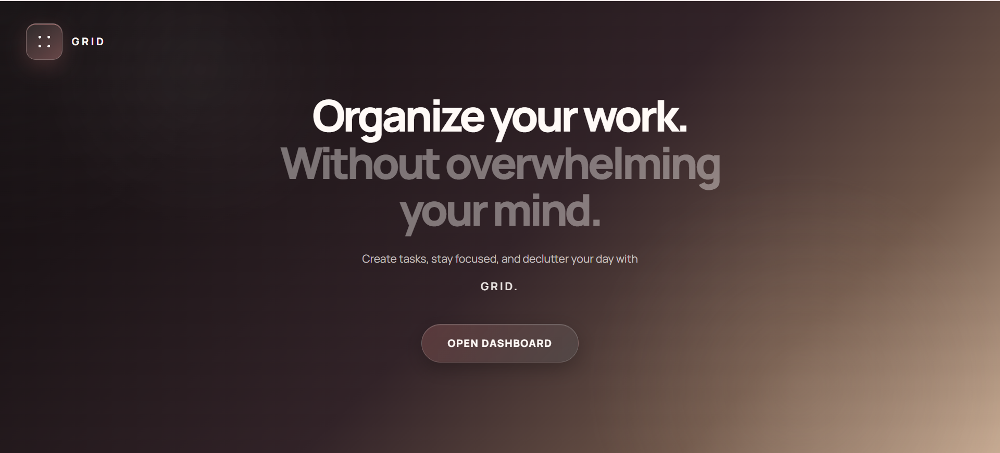
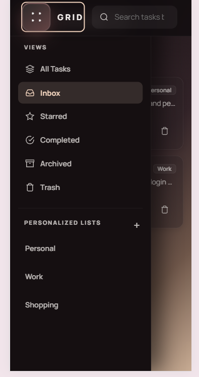

# GRID - Modern Task Management Dashboard

GRID is a modern and responsive task management web application built using HTML, CSS, and Vanilla JavaScript.

The application focuses on productivity, minimalism, and clean user experience while providing powerful task organization features such as custom lists, task prioritization, archiving, trash management, search, filtering, and task inspection panels.

---

## Objective

To build a responsive task management web application using HTML, CSS, and JavaScript that allows users to create, manage, complete, and delete tasks while maintaining data persistence using LocalStorage.

---

## Preview

### Landing Page



- Clean hero section
- Modern glassmorphism-inspired UI
- Responsive design
- CTA button to open dashboard

### Dashboard


- Task creation & editing
- Task completion system
- Starred tasks
- Archive & Trash management
- Search & sorting
- Custom list categories
- Inspector panel
- Undo toast notifications
- Fully responsive mobile layout

### Mobile View



---

## Features

### Task Management
- Create tasks
- Edit existing tasks
- Delete tasks
- Permanent deletion support
- Archive tasks
- Restore archived tasks
- Mark tasks as completed/incomplete
- Star important tasks

### Custom Lists
- Create personalized lists
- Rename lists
- Delete lists
- Assign tasks to custom categories

### Search & Sorting
- Real-time search
- Search by:
  - Task title
  - Description
  - Category
- Sorting options:
  - Newest
  - Alphabetical
  - Priority

### Productivity Features
- Undo system using toast notifications
- Task inspector/details panel
- Persistent data using Local Storage
- Empty state UI handling

### Responsive Design
- Mobile optimized sidebar drawer
- Responsive task cards
- Adaptive layout
- Touch-friendly controls

---

## Tech Stack

- HTML5
- CSS3
- Vanilla JavaScript
- LocalStorage API
- Google Fonts (Manrope)

---

## Methodology

The project was developed following a structured approach:

1. Designed the landing page and dashboard UI.
2. Implemented task creation and editing functionality.
3. Added task completion and deletion features.
4. Implemented archive and trash management.
5. Used LocalStorage to store tasks and custom lists.
6. Added search, sorting, and filtering features.
7. Improved responsiveness for mobile and tablet devices.
8. Tested persistence and user interactions.

---

## Core Functionalities

- Tasks are persisted using LocalStorage.
- Each task can be completed, starred, archived, or moved to trash.
- Undo functionality is provided through a rollback stack mechanism.

---

## Folder Structure

```bash
GRID/
│
├── assets/
├── css/
│   ├── dashboard.css
│   ├── global.css
│   └── home.css
│
├── js/
│   └── dashboard.js
│
├── dashboard.html
├── index.html
└── README.md
```

---

## How to Run the Project

### 1. Clone the Repository

```bash
git clone https://github.com/isha-hanaan/synent-task5-todoapp-isha.git
```

### 2. Navigate to the Project Folder

```bash
cd synent-task5-todoapp-isha
```

### 3. Open the Project

Open `index.html` in your browser.

---

## Hosted Application

[🌐 View Website](https://isha-hanaan.github.io/synent-task5-todoapp-isha/)

---

## Demo Video

[🎥 Watch on YouTube](https://youtu.be/9OHOhToHOj4)

---

## Project Report

### Problem Statement
Develop a To-Do List web application with persistent storage.

### Solution
Implemented a modern task management dashboard using HTML, CSS, and JavaScript with LocalStorage support.

### Result
Users can create, edit, complete, archive, and delete tasks while maintaining data after page refresh.

---

## Future Improvements

Potential upgrades for the application:

- Drag and drop task sorting
- Due dates & reminders
- Dark/light theme switcher
- User authentication
- Cloud sync/database integration
- Calendar view
- Subtasks & labels
- Keyboard shortcuts
- Progressive Web App (PWA) support
- Automatic permanent deletion of trashed tasks after a configurable number of days
- Multi-select task management
- “Select All” functionality for bulk task operations
- Bulk archive/delete/complete actions
- Task deadline notifications
- Task analytics & productivity insights
- Export/import task data
- Offline-first synchronization support

---

## Author

Created by **Isha Hanaan**

- GitHub: https://github.com/isha-hanaan

---

## License

This project was developed for educational and internship assignment purposes under Synent Task 5.
